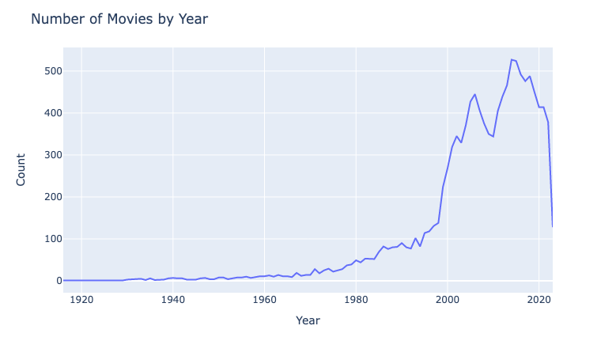
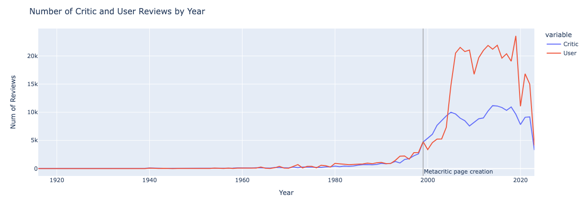
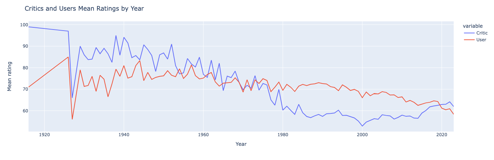
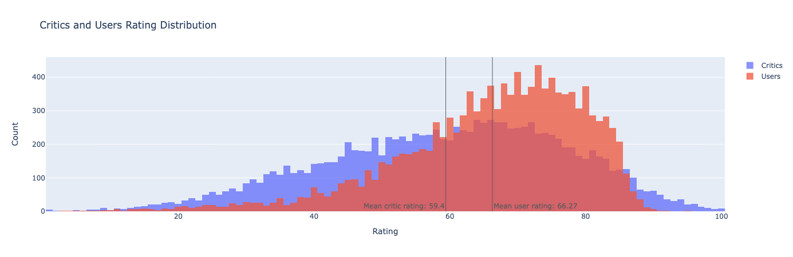
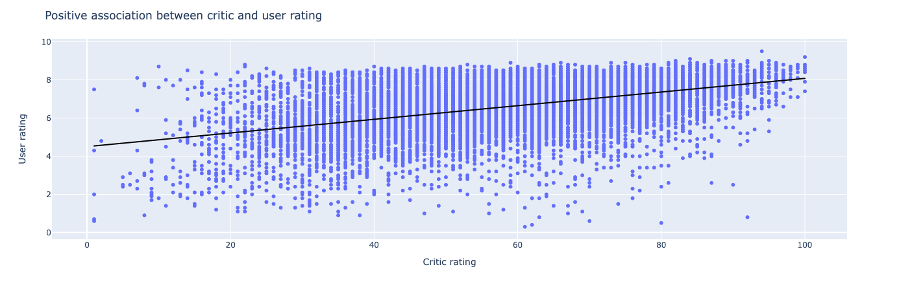
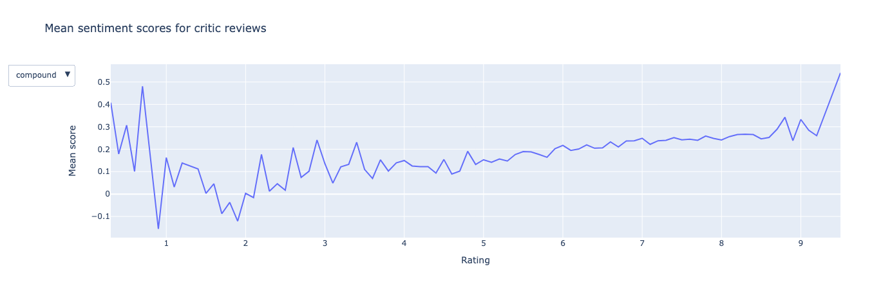
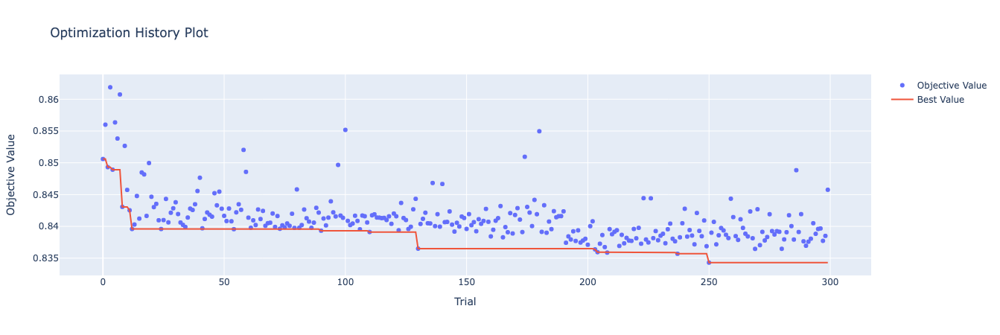

# Metacritic User Rating Prediction
Predicting [Metacritic](https://www.metacritic.com/movie) user ratings with data available before a movie is released such as critic reviews, critic ratings, and genre.

# Why it matters?
Oftentimes, you see a bad review of a movie from critics and think that you won't enjoy the movie. However, when you go to a theater and watch the movie for yourself, you find out you actually enjoy the movie. This happened to me when I watched [Extraction 2](https://www.metacritic.com/movie/extraction-2), [Transformers: Rise of the Beasts](https://www.metacritic.com/movie/transformers-rise-of-the-beasts), and [Guardians of the Galaxy Vol. 3](https://www.metacritic.com/movie/guardians-of-the-galaxy-vol-3). The opposite situation also happened for movies like [Renfield](https://www.metacritic.com/movie/renfield), and sometimes, critic ratings are similar to user ratings such as [Fast X](https://www.metacritic.com/movie/fast-x).

So it seems like critics and users rate the same movie differently, and that leads to different overall ratings. It makes sense because while users generally watch movies for enjoyment, critics expect movies to be a masterpiece in terms of art. Thus, if users solely believe in what critics say about a movie and watch it, they might not get what they want from watching the movie. So what if we can predict users' ratings with text features from critic reviews? If this is possible, users will have a better understanding of what to expect from movies better than before.

# Overview
- Websraped movie info, critic reviews, and user reviews from [Metacritic](https://www.metacritic.com/movie) using Python `BeautifulSoup` and stored in `SQLite` database.
- Extracted text sentiment features using `nltk.sentiment.SentimentIntensityAnalyzer` and keywords using `KeyBERT`.
- Analyzed scraped data using `plotly`.
- Improved mean absolute error by 37.69% when predicting user rating using features from critic reviews compared to assuming user ratings are equal to critic ratings.

# Data Collection

Webscraped using this [script](https://github.com/bbeat2782/Projects/blob/rating_pred/rating_pred/collect_ratings.ipynb).

## Original dataset

### 1. `Movie` table
The following are sample rows from the `Movie` table that contains movie information from Metacritic as of 2023 June 16.

|    |             movie_id | movie_title    |   movie_year | movie_summary                                     |   movie_critic_rating |   movie_user_rating |   movie_runtime | movie_genre   | movie_subgenre   | movie_sub2genre   | movie_rating   |   num_critic_pos |   num_critic_mix |   num_critic_neg |   num_user_pos |   num_user_mix |   num_user_neg |
|---:|---------------------:|:---------------|-------------:|:--------------------------------------------------|----------------------:|--------------------:|----------------:|:--------------|:-----------------|:------------------|:---------------|-----------------:|-----------------:|-----------------:|---------------:|---------------:|---------------:|
|  0 | -9222320398758708885 | Generation War |         2014 | In Berlin in 1941, on the eve of Hitler’s inva... |                    57 |                 7.4 |             270 | Drama         | History          | War               | Not Rated      |                4 |               10 |                0 |             34 |              7 |              6 |
|  1 | -9219956025103179742 | Gun Crazy      |         1950 | A well meaning crack shot husband is pressured... |                    74 |                 7.8 |              87 | Drama         | Thriller         | Romance           | Passed         |               11 |                3 |                0 |              4 |              1 |              0 |
|  2 | -9218594262706343994 | Iluzija        |         2006 | Tortured by a tumultuous home life and school ... |                    61 |                 8.1 |             107 | Drama         | None             | None              | Not Rated      |                5 |                2 |                1 |             14 |              0 |              3 |
|  3 | -9216529779443115283 | Fired Up!      |         2009 | Shawn and Nick are top scorers on the Ford Hig... |                    31 |                 5.7 |              90 | Comedy        | None             | None              | PG-13          |                2 |                7 |                9 |             19 |             12 |             10 |
|  4 | -9212162946756563061 | Uncharted      |         2022 | Street-smart Nathan Drake (Tom Holland) is rec... |                    45 |                 6.2 |             116 | Action        | Adventure        | None              | PG-13          |                7 |               33 |                4 |            451 |            169 |            175 |

### 2. `Critics` table
The following are sample rows from the `Critics` table that contains critic review information of movies from the `Movie` table.

|    |   critic_review_id |             movie_id | critic_name        | critic_review                                     | critic_date   |   critic_rating |
|---:|-------------------:|---------------------:|:-------------------|:--------------------------------------------------|:--------------|----------------:|
|  0 |             145643 | -1562356960487678241 | Joshua Land        | The result may be better suited for classroom ... | None          |              60 |
|  1 |             163070 | -8573132570105916711 | Peter Bradshaw     | This is a strong, fierce, heartfelt movie.        | Nov 30, 2022  |              80 |
|  2 |             208027 |  -433637604116680176 | Amy Nicholson      | The screenplay, adapted by Peter Craig, Hillar... | Dec  9, 2021  |              40 |
|  3 |             191435 | -1173456695746148219 | Stephanie Zacharek | Disappointingly tame.                             | None          |              50 |
|  4 |             104342 | -4403818285690920111 | Tim Grierson       | Despite its shortcomings, American Made can be... | Sep 28, 2017  |              72 |

### 3. `Users` table
The following are sample rows from the `Users` table that contains user review information of movies from the Movie table.

|    |   user_review_id |             movie_id | user_review                                       | user_date    |   user_rating |
|---:|-----------------:|---------------------:|:--------------------------------------------------|:-------------|--------------:|
|  0 |            74238 | -3697458530605139559 | Begginers is my favorite romantic movie and on... | Oct 26, 2020 |            10 |
|  1 |            11168 |  4282306499439292174 | This movie feels like Imagine walking through ... | Jan 25, 2020 |             9 |
|  2 |           310577 | -6871826492128334529 | The movie might lose its focus in the second h... | Aug 27, 2010 |             6 |
|  3 |           185273 |  7131247308218877535 | The one I really like was tribute to chadwick ... | Feb  2, 2023 |             5 |
|  4 |           164346 |  -781771689375929617 | Enough scares to keep you on the edge of your ... | Dec 21, 2020 |             8 |

# Data Preprocessing

### 1. Extracting Sentiment Scores
With `SentimentIntensityAnalyzer` from the `nltk` package, I extracted negative, neutral, positive, and compound scores of combined reviews from each movie.

```
from nltk.sentiment import SentimentIntensityAnalyzer

sia = SentimentIntensityAnalyzer()
polarity = sia.polarity_scores(text)
```

### 2. Extracting Keywords
With the `KeyBERT` from the `keybert` package, I extracted keywords from combined reviews for each possible rating from 0.0 to 10.0.

```
kw_model = KeyBERT(model='all-MiniLM-L6-v2')
kw = kw_model.extract_keywords(corpus, 
                               keyphrase_ngram_range=(1, 1), 
                               stop_words='english',
                               use_maxsum=True,
                               top_n=20)
```

From the code block above,
- `keyphrase_ngram_range`: Controls the ngram range of extracted keywords
- `use_maxsum`: Controls the combination of the sum of cosine similarity to be the maximum value from 2 x top_n words to diversify the results
- `top_n` : Controls the number of keywords to extract

### Final Dataframe after Preprocessing

|      |   movie_year |   movie_critic_rating |   movie_user_rating |   num_critic_pos |   num_critic_mix |   num_critic_neg |   mean_neg |   std_neg |   mean_neu |   std_neu |   mean_pos |   std_pos |   mean_compound |   std_compound | Action   | Adventure   | Animation   | Biography   | Comedy   | Crime   | Documentary   | Drama   | Family   | Fantasy   | History   | Horror   | Music   | Musical   | Mystery   | Romance   | Sci-Fi   | Sport   | Thriller   | War   | Approved   | G     | NC-17   | NR    | Not Rated   | PG    | PG-13   | Passed   | R     | TV-14   | TV-G   | TV-MA   | TV-PG   | Unrated   |   lively |   ambitious |   meticulously |   genre |   sophisticated |   elegant |   suspenseful |   elusive |   dull |   mediocre |   hackneyed |   stylish |   skillful |   stylishly |   portray |   innocuous |   archetypal |   strenuous |   artful |   expressive |   underdeveloped |   richly |   ambitiously |   charismatic |   witless |   leisurely |   sublimely |   fiercely |   shallow |   uninspired |   write |   likable |   perform |   entertain |   operatic |   transcend |   unpretentious |   artistic |   fleeting |   earnestly |   eminently |   pensive |   spell |   act |   achieve |   unspeakable |   flourish |   performative |   characterize |   darkly |   wander |   easygoing |   stylistic |   inherent |   voluptuous |   novelistic |   cinematic |   fiendishly |   youthful |   emphasize |   earnestness |   underwhelme |   inoffensive |   shrill |   lean |   succeed |   invaluable |   transcendent |   virtuous |   grindingly |   wistful |   improvisational |   convey |   eclectic |   whimsical |   comic |   melodramatic |   turn |   lackadaisical |   aestheticize |   passably |   sophomoric |   extensive |   pure |   abrupt |   blandly |   irresistible |   dramatic |   distressingly |   mundane |   overact |   satirize |   clichés |   improvise |   languidly |   abandon |   broodingly |   dramatized |   conspicuously |   adjective |   eloquent |   universally |   relentlessly |   unrestrained |   grimly |   filmic |   impenetrable |   excite |   operatically |   playful |   sharp |   swiftly |   expressively |   charitably |   strenuously |   searingly |   comical |   breathtaking |   boring |   torturous |   bombastic |   resonate |   reverential |   unlikable |   virtuosic |   mischievous |   lyrical |   sophisticate |   gradual |   classically |   instructive |   rebellious |   effortlessly |   esoteric |   androgynous |   melancholy |   rueful |   atrocious |   somber |   weary |   lackluster |   meticulous |   superficial |   imaginative |   extraordinary |   meaningful |   seductive |   dullish |   rambunctious |
|-----:|-------------:|----------------------:|--------------------:|-----------------:|-----------------:|-----------------:|-----------:|----------:|-----------:|----------:|-----------:|----------:|----------------:|---------------:|:---------|:------------|:------------|:------------|:---------|:--------|:--------------|:--------|:---------|:----------|:----------|:---------|:--------|:----------|:----------|:----------|:---------|:--------|:-----------|:------|:-----------|:------|:--------|:------|:------------|:------|:--------|:---------|:------|:--------|:-------|:--------|:--------|:----------|---------:|------------:|---------------:|--------:|----------------:|----------:|--------------:|----------:|-------:|-----------:|------------:|----------:|-----------:|------------:|----------:|------------:|-------------:|------------:|---------:|-------------:|-----------------:|---------:|--------------:|--------------:|----------:|------------:|------------:|-----------:|----------:|-------------:|--------:|----------:|----------:|------------:|-----------:|------------:|----------------:|-----------:|-----------:|------------:|------------:|----------:|--------:|------:|----------:|--------------:|-----------:|---------------:|---------------:|---------:|---------:|------------:|------------:|-----------:|-------------:|-------------:|------------:|-------------:|-----------:|------------:|--------------:|--------------:|--------------:|---------:|-------:|----------:|-------------:|---------------:|-----------:|-------------:|----------:|------------------:|---------:|-----------:|------------:|--------:|---------------:|-------:|----------------:|---------------:|-----------:|-------------:|------------:|-------:|---------:|----------:|---------------:|-----------:|----------------:|----------:|----------:|-----------:|----------:|------------:|------------:|----------:|-------------:|-------------:|----------------:|------------:|-----------:|--------------:|---------------:|---------------:|---------:|---------:|---------------:|---------:|---------------:|----------:|--------:|----------:|---------------:|-------------:|--------------:|------------:|----------:|---------------:|---------:|------------:|------------:|-----------:|--------------:|------------:|------------:|--------------:|----------:|---------------:|----------:|--------------:|--------------:|-------------:|---------------:|-----------:|--------------:|-------------:|---------:|------------:|---------:|--------:|-------------:|-------------:|--------------:|--------------:|----------------:|-------------:|------------:|----------:|---------------:|
|  950 |         2018 |                    80 |                 7.3 |               22 |                0 |                0 |  0.0898182 | 0.10236   |   0.741182 | 0.175149  |   0.169    | 0.119288  |        0.259555 |       0.42102  | False    | False       | False       | False       | False    | False   | False         | False   | False    | True      | False     | False    | False   | False     | False     | False     | True     | False   | True       | False | False      | False | False   | False | True        | False | False   | False    | False | False   | False  | False   | False   | False     |        0 |           0 |              0 |       0 |          0.2915 |         0 |             0 |         0 |      0 |          0 |           0 |    0      |     0.3255 |           0 |         0 |           0 |            0 |           0 |        0 |            0 |                0 |   0      |             0 |        0.4243 |         0 |           0 |           0 |          0 |         0 |            0 |  0      |         0 |         0 |      0      |          0 |           0 |               0 |          0 |          0 |           0 |           0 |         0 |       0 |     0 |         0 |             0 |          0 |              0 |              0 |        0 |        0 |      0      |           0 |          0 |            0 |            0 |      0.3182 |            0 |          0 |           0 |             0 |             0 |             0 |        0 |      0 |         0 |            0 |              0 |          0 |            0 |         0 |                 0 |        0 |          0 |           0 |  0      |              0 |      0 |               0 |              0 |          0 |            0 |           0 |      0 |        0 |         0 |              0 |          0 |               0 |         0 |         0 |          0 |         0 |           0 |           0 |         0 |            0 |            0 |               0 |           0 |          0 |             0 |              0 |              0 |        0 |        0 |              0 |        0 |              0 |         0 |  0      |         0 |              0 |            0 |             0 |           0 |         0 |              0 |        0 |           0 |           0 |          0 |             0 |           0 |           0 |             0 |    0      |              0 |         0 |             0 |        0      |            0 |              0 |          0 |             0 |            0 |        0 |           0 |        0 |       0 |            0 |            0 |             0 |             0 |               0 |            0 |      0      |         0 |              0 |
|  154 |         2013 |                    37 |                 4   |                5 |                6 |               10 |  0.0489524 | 0.0697262 |   0.79     | 0.0803847 |   0.161095 | 0.0894974 |        0.438767 |       0.415727 | True     | True        | True        | False       | False    | False   | False         | False   | False    | False     | False     | False    | False   | False     | False     | False     | False    | False   | False      | False | False      | False | False   | False | False       | True  | False   | False    | False | False   | False  | False   | False   | False     |        0 |           0 |              0 |       0 |          0      |         0 |             0 |         0 |      0 |          0 |           0 |    0      |     0      |           0 |         0 |           0 |            0 |           0 |        0 |            0 |                0 |   0      |             0 |        0      |         0 |           0 |           0 |          0 |         0 |            0 |  0.2503 |         0 |         0 |      0      |          0 |           0 |               0 |          0 |          0 |           0 |           0 |         0 |       0 |     0 |         0 |             0 |          0 |              0 |              0 |        0 |        0 |      0      |           0 |          0 |            0 |            0 |      0      |            0 |          0 |           0 |             0 |             0 |             0 |        0 |      0 |         0 |            0 |              0 |          0 |            0 |         0 |                 0 |        0 |          0 |           0 |  0      |              0 |      0 |               0 |              0 |          0 |            0 |           0 |      0 |        0 |         0 |              0 |          0 |               0 |         0 |         0 |          0 |         0 |           0 |           0 |         0 |            0 |            0 |               0 |           0 |          0 |             0 |              0 |              0 |        0 |        0 |              0 |        0 |              0 |         0 |  0      |         0 |              0 |            0 |             0 |           0 |         0 |              0 |        0 |           0 |           0 |          0 |             0 |           0 |           0 |             0 |    0      |              0 |         0 |             0 |        0.2513 |            0 |              0 |          0 |             0 |            0 |        0 |           0 |        0 |       0 |            0 |            0 |             0 |             0 |               0 |            0 |      0      |         0 |              0 |
| 5106 |         2016 |                    44 |                 4.8 |                2 |                8 |                4 |  0.0680714 | 0.0749127 |   0.782357 | 0.150659  |   0.149429 | 0.114685  |        0.222329 |       0.442291 | False    | False       | False       | False       | False    | False   | False         | True    | False    | False     | False     | False    | False   | False     | True      | False     | False    | False   | True       | False | False      | False | False   | False | False       | False | False   | False    | True  | False   | False  | False   | False   | False     |        0 |           0 |              0 |       0 |          0      |         0 |             0 |         0 |      0 |          0 |           0 |    0.3621 |     0      |           0 |         0 |           0 |            0 |           0 |        0 |            0 |                0 |   0      |             0 |        0      |         0 |           0 |           0 |          0 |         0 |            0 |  0      |         0 |         0 |      0      |          0 |           0 |               0 |          0 |          0 |           0 |           0 |         0 |       0 |     0 |         0 |             0 |          0 |              0 |              0 |        0 |        0 |      0      |           0 |          0 |            0 |            0 |      0      |            0 |          0 |           0 |             0 |             0 |             0 |        0 |      0 |         0 |            0 |              0 |          0 |            0 |         0 |                 0 |        0 |          0 |           0 |  0      |              0 |      0 |               0 |              0 |          0 |            0 |           0 |      0 |        0 |         0 |              0 |          0 |               0 |         0 |         0 |          0 |         0 |           0 |           0 |         0 |            0 |            0 |               0 |           0 |          0 |             0 |              0 |              0 |        0 |        0 |              0 |        0 |              0 |         0 |  0      |         0 |              0 |            0 |             0 |           0 |         0 |              0 |        0 |           0 |           0 |          0 |             0 |           0 |           0 |             0 |    0      |              0 |         0 |             0 |        0      |            0 |              0 |          0 |             0 |            0 |        0 |           0 |        0 |       0 |            0 |            0 |             0 |             0 |               0 |            0 |      0.3782 |         0 |              0 |
| 3812 |         2006 |                    57 |                 7.7 |                6 |                5 |                1 |  0.073     | 0.0795647 |   0.677917 | 0.234736  |   0.249167 | 0.185589  |        0.470967 |       0.343457 | False    | False       | False       | False       | False    | False   | True          | False   | False    | False     | False     | False    | False   | False     | False     | False     | False    | False   | False      | False | False      | False | False   | False | True        | False | False   | False    | False | False   | False  | False   | False   | False     |        0 |           0 |              0 |       0 |          0      |         0 |             0 |         0 |      0 |          0 |           0 |    0      |     0      |           0 |         0 |           0 |            0 |           0 |        0 |            0 |                0 |   0.2622 |             0 |        0      |         0 |           0 |           0 |          0 |         0 |            0 |  0      |         0 |         0 |      0.3241 |          0 |           0 |               0 |          0 |          0 |           0 |           0 |         0 |       0 |     0 |         0 |             0 |          0 |              0 |              0 |        0 |        0 |      0.2933 |           0 |          0 |            0 |            0 |      0      |            0 |          0 |           0 |             0 |             0 |             0 |        0 |      0 |         0 |            0 |              0 |          0 |            0 |         0 |                 0 |        0 |          0 |           0 |  0      |              0 |      0 |               0 |              0 |          0 |            0 |           0 |      0 |        0 |         0 |              0 |          0 |               0 |         0 |         0 |          0 |         0 |           0 |           0 |         0 |            0 |            0 |               0 |           0 |          0 |             0 |              0 |              0 |        0 |        0 |              0 |        0 |              0 |         0 |  0      |         0 |              0 |            0 |             0 |           0 |         0 |              0 |        0 |           0 |           0 |          0 |             0 |           0 |           0 |             0 |    0.4796 |              0 |         0 |             0 |        0      |            0 |              0 |          0 |             0 |            0 |        0 |           0 |        0 |       0 |            0 |            0 |             0 |             0 |               0 |            0 |      0      |         0 |              0 |
| 9214 |         2002 |                    48 |                 5.6 |               10 |               19 |                6 |  0.0549032 | 0.101778  |   0.813774 | 0.136019  |   0.131323 | 0.0995089 |        0.274816 |       0.465311 | False    | False       | False       | False       | True     | False   | False         | False   | False    | False     | False     | False    | False   | False     | False     | False     | False    | False   | False      | False | False      | False | False   | False | False       | False | True    | False    | False | False   | False  | False   | False   | False     |        0 |           0 |              0 |       0 |          0      |         0 |             0 |         0 |      0 |          0 |           0 |    0      |     0      |           0 |         0 |           0 |            0 |           0 |        0 |            0 |                0 |   0      |             0 |        0      |         0 |           0 |           0 |          0 |         0 |            0 |  0      |         0 |         0 |      0      |          0 |           0 |               0 |          0 |          0 |           0 |           0 |         0 |       0 |     0 |         0 |             0 |          0 |              0 |              0 |        0 |        0 |      0      |           0 |          0 |            0 |            0 |      0      |            0 |          0 |           0 |             0 |             0 |             0 |        0 |      0 |         0 |            0 |              0 |          0 |            0 |         0 |                 0 |        0 |          0 |           0 |  0.2505 |              0 |      0 |               0 |              0 |          0 |            0 |           0 |      0 |        0 |         0 |              0 |          0 |               0 |         0 |         0 |          0 |         0 |           0 |           0 |         0 |            0 |            0 |               0 |           0 |          0 |             0 |              0 |              0 |        0 |        0 |              0 |        0 |              0 |         0 |  0.2358 |         0 |              0 |            0 |             0 |           0 |         0 |              0 |        0 |           0 |           0 |          0 |             0 |           0 |           0 |             0 |    0      |              0 |         0 |             0 |        0      |            0 |              0 |          0 |             0 |            0 |        0 |           0 |        0 |       0 |            0 |            0 |             0 |             0 |               0 |            0 |      0      |         0 |              0 |

# Visualizations

### Number of movies
- 
- #### Observations
    1. Data were collected in 2023, June 16th, so 2023 has much fewer movies than years before.
    2. The early and mid-1900s have fewer movies than in recent years. This could be an actual difference in movie production or not all films are recorded from the early and mid-1900s.
    3. There are two noticeable declines. One starts in 2006. Another one starts in 2014.

### Number of reviews comparison
- 
- #### Observations
    1. The number of reviews increased around the 1990s. Three possible explanations are 1) the Internet became popular around mid-1990 2) the number of movies on the Metacritic website increases around mid-1990 or 3) the website was created in 1999.
    2. From 1999 to 2004, critics left more reviews than users. This trend changes after 2004.
    3. The critic reviews line plot follows the number of movies by year trend. However, the user reviews line plot tends to fluctuate more.
    4. Both line plots show a decline in 2020 (the year covid started). Between the two, the user line plot shows a larger decrease.

### Mean rating trend comparison
- 
- #### Caution
    - User rating ranges from 0 to 10, whereas critic rating ranges from 0 to 100. Thus, to match the range, I multiplied user ratings by 10.

- #### Observations
    1. Mean user rating tends to decline, whereas mean critic rating declines at first and increases after 2000.
    2. For movies before 1970, mean critic ratings tend to be higher than mean user ratings. However, after 1970, the trend reverses. This trend reverses again in 2020.
        - This could be because of how critics and users rate different genres differently and different genres were popular at different times. Or it could be because of a difference in what they value from watching a movie.
        - Recall that not a lot of movies from the early 1900s are on the Metacritic website. It could be that only critically acclaimed movies are on the website such as [Citizen Kane](https://www.metacritic.com/movie/citizen-kane-1941), [Vertigo](https://www.metacritic.com/movie/vertigo-1958), or [Rear Window](https://www.metacritic.com/movie/rear-window). All these films have a rating of 100 out of 100 from critics but below 10 out of 10 from users. This might be the reason why mean critic ratings are higher than mean user ratings in the early 1900s.

### Rating distribution comparison
- 
- #### Observations
    1. Critics rating distribution is closer to a normal distribution than users rating distribution.
    2. Users' rating is skewed to the left with a higher overall mean than critics' rating. For each user and critic, the overall means are 66.27 and 59.4

### Association between critic and user
- 
- #### Observations
    1. There is a positive association between critic and user ratings.
    2. The least squares best-fit line is **User rating = 0.0357518 * Critic rating + 4.50315**
        - For 1 increase in critic rating, we can expect user rating to increase by 0.0357518
    3. It shows heteroscedasticity. The variability is higher when the critic rating is low than when it is high.
    4. The max user rating for all ranges of critic ratings tends to stay the same. However, the increase in the min user rating as the critic rating increases is clearly visible.

### Sentiment analysis for combined reviews for each rating
- 
- #### Observations
    1. Since I'm looking at collective users' ratings for each movie, the rating ranges from 0 to 10 with a 0.1 increment.
    2. The compound score starts from 0.4 at a rating of 0, decreases until a rating of around 2, and increases until a rating of 10. 
        - This can be interpreted as movies that critics are positive about can be rated as 0 or 10 by users.
        - Movies that critics are negative about tend to get a user rating between 1 and 2.5.

# Prediction

Performed hyperparameter tuning with `Optuna` using `lightgbm.LightGBMRegressor` as a model ([notebook](https://github.com/bbeat2782/Projects/blob/rating_pred/rating_pred/predict.ipynb)).

```
def objective(trial, data = X_train, target = y_train):
    param_grid = {
        "n_estimators": trial.suggest_categorical("n_estimators", [10000]),
        "learning_rate": trial.suggest_float("learning_rate", 0.01, 0.3),
        "num_leaves": trial.suggest_int("num_leaves", 20, 2000, step=20),
        "max_depth": trial.suggest_int("max_depth", 3, 12),
        "max_bin": trial.suggest_int("max_bin", 200, 300),
        "reg_alpha": trial.suggest_int("reg_alpha", 0, 100, step=5),
        "reg_lambda": trial.suggest_int("reg_lambda", 0, 100, step=5),
        "min_split_gain": trial.suggest_float("min_split_gain", 0, 15),
        "subsample": trial.suggest_float("subsample", 0.2, 1.0, step=0.1),
        "colsample_bytree": trial.suggest_float("colsample_bytree", 0.2, 1.0, step=0.1),
        "min_child_samples": trial.suggest_int("min_child_samples", 1,500),
    }

    cv = KFold(n_splits=5, shuffle=True)
    cv_scores = np.empty(5)

    for idx, (train_idx, val_idx) in enumerate(cv.split(data, target)):
        X_t, X_v = data.iloc[train_idx], data.iloc[val_idx]
        y_t, y_v = target.iloc[train_idx], target.iloc[val_idx]

        model = lgb.LGBMRegressor(**param_grid)
        model.fit(X_t, y_t, eval_set=[(X_v, y_v)], eval_metric='mape',
                  callbacks=[lgb.early_stopping(stopping_rounds=100),
                             lgb.log_evaluation(period=0)])
        preds = model.predict(X_v)
        cv_scores[idx] = mean_absolute_error(y_v, preds)
    
    return np.mean(cv_scores)


study = optuna.create_study(direction='minimize')
study.optimize(objective, n_trials=300)
```
### Result of the optimization process
- 

### Feature importance
|     | Feature             |   Importance |
|----:|:--------------------|-------------:|
|   0 | movie_year          |          102 |
|   1 | movie_critic_rating |           83 |
|   2 | num_critic_pos      |           43 |
|   4 | num_critic_neg      |           28 |
|   9 | mean_pos            |           26 |
|   7 | mean_neu            |           23 |
|  10 | std_pos             |           21 |
|  11 | mean_compound       |           18 |
|  12 | std_compound        |           16 |
|   8 | std_neu             |           13 |
|   5 | mean_neg            |           12 |
| ... | ...                 |          ... |
|  21 | Family              |            1 |
|  46 | Unrated             |            1 |

### Predicted result
|      |   True |   Predict |
|-----:|-------:|----------:|
|    0 |    8   |   6.63514 |
|    1 |    7.8 |   7.36846 |
|    2 |    6.7 |   6.92814 |
|    3 |    6.2 |   6.42496 |
|    4 |    6.2 |   6.43058 |
|  ... |    ... |   ...     |
| 2330 |    7.5 |   7.64216 |
| 2331 |    4.9 |   5.79924 |
| 2332 |    6.3 |   5.84634 |
| 2333 |    6.3 |   7.45201 |

### Mean absolute error when treating user rating is equal to critic rating
```
print(mean_absolute_error(user, critic))

>>> 1.368877016551435
```

### Mean absolute error for the test dataset
```
model = lgb.LGBMRegressor(**best_trial, early_stopping_rounds=100)
model.fit(X_train, y_train, eval_set=[(X_val, y_val)],
          callbacks=[lgb.log_evaluation(period=0)])
y_pred = model.predict(X_test)
print(mean_absolute_error(y_test, y_pred))

>>> 0.8530118478423075
```

### As a result of feature engineering and hyperparameter tuning, I'm able to predict the user rating of a movie with critic reviews with a 0.853 mean absolute error. It is a 37.69% improvement compared to believing the user rating is equal to the critic rating.
