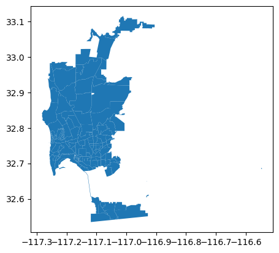
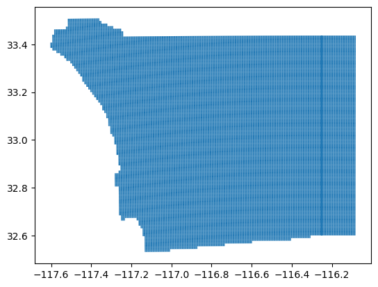
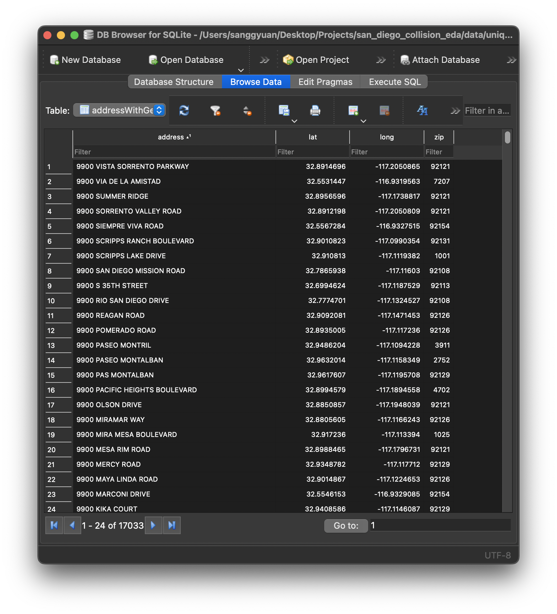
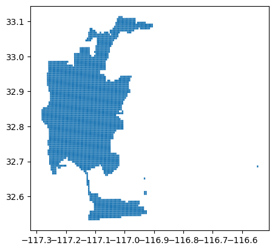
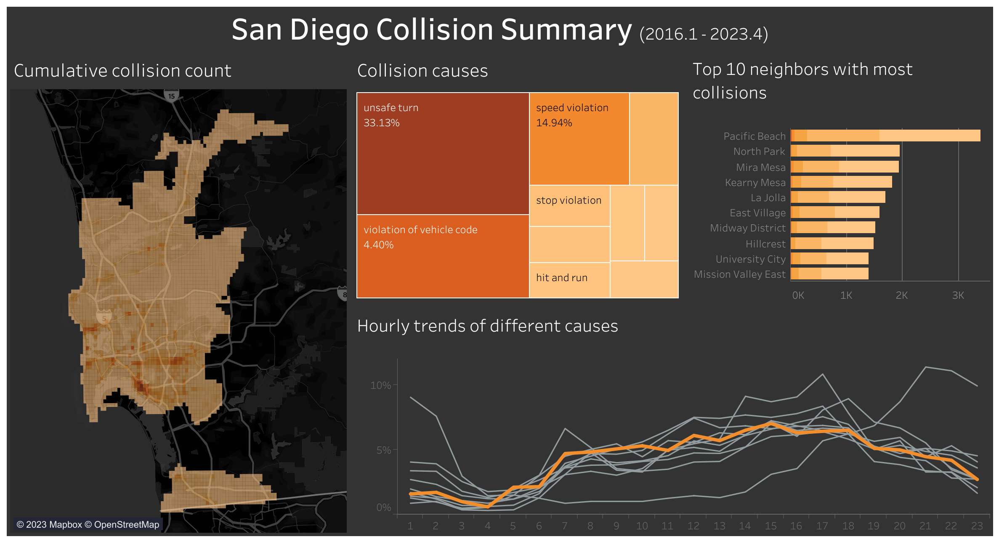

# San Diego Collision EDA
Exploratory data analysis project using Tableau for analyzing San Diego County Collision since 2016

# Why it matters?
In Korea, a car navigation system notifies me whenever I enter an "accident-prone area". This especially helped me to stay alert in those areas so that I don't get into an accident. However, as far as I know, there is no such service in a navigation system in the US. Thus, I was curious about what areas in San Diego are "accident-prone areas" so that I and other drivers in San Diego need to be extra cautious while driving.

On top of that, as an inexperienced driver, I was always told in Korea that lane change is the hardest task. I found this is true for myself since it was hard to be inside a lane and know the exact timing of when to tilt a handle so that I don't crash with a car behind me. However, one of the reasons for this is that Korea has narrow lanes. Since lanes in the US aren't as narrow as those in Korea, I wanted to explore whether lane change is also the main cause of car collisions or if there are other actions I need to be more cautious of.

# Overview
- Grabbed original dataset from City of San Diego Open Data Portal, [Traffic Collisions - basic reports](https://data.sandiego.gov/datasets/police-collisions/) and [Police Beats](https://data.sandiego.gov/datasets/police-beats/) and grid map of San Diego from [SanGis](https://www.sangis.org/)
- Applied geocoding to unique addresses using Python and Google Geocoding API
- Stored latitude, longitude, zipcode in SQLite database
- Engineered features from the text of each unique charge description to group them into larger categories
- Created interactive visualization with Tableau so that viewers can look at specific location in San Diego County

## Data Collection

### Original dataset

#### 1. Traffic Collisions - basic reports
The following is a sample rows from the dataset that contains record from 2015 January to 2023 May. It's downloaded from City of San Diego Open Data Portal, and it updates daily.

|    |   report_id | date_time           |   police_beat |   address_no_primary | address_pd_primary   | address_road_primary   | address_sfx_primary   | address_pd_intersecting   | address_name_intersecting   | address_sfx_intersecting   | violation_section   | violation_type   | charge_desc                                            |   injured |   killed | hit_run_lvl   |
|---:|------------:|:--------------------|--------------:|---------------------:|:---------------------|:-----------------------|:----------------------|:--------------------------|:----------------------------|:---------------------------|:--------------------|:-----------------|:-------------------------------------------------------|----------:|---------:|:--------------|
|  0 |      171111 | 2015-01-14 20:00:00 |           835 |                 4200 |                      | JUNIPER                | STREET                |                           |                             |                            | MISC-HAZ            | VC               | MISCELLANEOUS HAZARDOUS VIOLATIONS OF THE VEHICLE CODE |         0 |        0 | MISDEMEANOR   |
|  1 |      192016 | 2015-03-19 12:00:00 |           622 |                 5200 |                      | LINDA VISTA            | ROAD                  |                           |                             |                            | MISC-HAZ            | VC               | MISCELLANEOUS HAZARDOUS VIOLATIONS OF THE VEHICLE CODE |         0 |        0 | MISDEMEANOR   |
|  2 |      190012 | 2015-03-24 03:05:00 |           626 |                 1000 | W                    | WASHINGTON             | STREET                |                           |                             |                            | 22107               | VC               | TURNING MOVEMENTS AND REQUIRED SIGNALS                 |         2 |        0 | nan           |
|  3 |      191866 | 2015-03-27 23:56:00 |           613 |                 2800 |                      | WORDEN                 | STREET                |                           |                             |                            | 22107               | VC               | TURNING MOVEMENTS AND REQUIRED SIGNALS                 |         1 |        0 | nan           |
|  4 |      185207 | 2015-07-06 11:45:00 |           813 |                 2800 |                      | EL CAJON               | BOULEVARD             |                           |                             |                            | 20002(A)            | VC               | HIT AND RUN                                            |         0 |        0 | MISDEMEANOR   |

#### 2. Police Beats
The following is a mapping of *police_beat* values from the above dataset into neighbor names in San Diego. It also contains the shp files of each neighbors.

|    |   beat | neighborhood         |
|---:|-------:|:---------------------|
|  0 |    111 | Clairemont Mesa East |
|  1 |    112 | Clairemont Mesa West |
|  2 |    113 | Bay Ho               |
|  3 |    114 | North Clairemont     |
|  4 |    115 | University City      |



#### 3. Grid Map of San Diego 
The following is a sub grid of the Regional Public Safety Geodatabase's Public Safety Grid. Each grid is about 0.3 miles * 0.6 miles (width * height).



### Geocoding
Used this [script](https://github.com/bbeat2782/Projects/blob/main/san_diego_collision_eda/retrieve_geocode.ipynb) to geocode addresses using Google Geocoding API and store in a SQLite database.



## Data Cleaning

#### 1. charge_desc Mapping
Because charge_desc (charge description) values in the **Traffic Collisions - basic reports** are hand recorded by different police officers, different abbreviations and wordings are used throughout the rows. Thus, I needed to group them into higher level categories. Below is a sample mapping.

|     | original_cause                                    | abbreviate_cause      |
|----:|:--------------------------------------------------|:----------------------|
|   0 | DRVG WITHOUT VALID DRVR'S LIC (M)                 | without valid license |
|   1 | TURNING MOVEMENTS AND REQUIRED SIGNALS            | unsafe turn           |
|   2 | HIT AND RUN RESULTING IN DEATH OR INJURY(IBR 90Z) | hit and run           |
|   3 | PEDESTRIAN NOT TO SUDDENLY ENTER PATH, ETC        | pedestrian            |
|   4 | FAIL TO STOP AT LIMIT LINE AT RR CROSSING (I)     | stop violation        |

#### 2. Geocoding Cleaning
Google Geocoding API were unable to locate some addresses due to incorrect address and unable to understanding Spanish abbreviations of address such as CAM for Camino and CMT for Caminito. Thus, I needed to confirm those by hand.

#### 3. Shape File Cleaning
Since I'm only interested in collisions in San Diego, I used the shp file from **Police Beats** to only extract grids that overlap with polygons from **Police Beats**

```
# using intersects() from geopandas
extract_necessary_grids = [np.any(police_beat['geometry'].intersects(g)) for g in sd_grid['geometry']]
sd_grid_trim = sd_grid[extract_necessary_grids]
```



## Visualization

[](https://public.tableau.com/app/profile/sanggyu.an/viz/SanDiegoCollisionSummary/Dashboard1)
